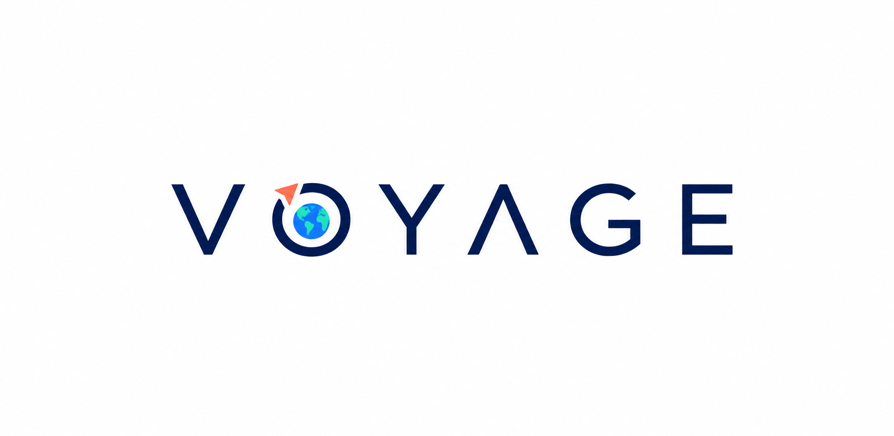

# Voyage

[](https://github.com/ejohane/voyage/actions/workflows/ci.yml)



Voyage is the shared home for a trip: one place where everyone traveling can understand the plan,
save travel and accommodation details, and know what matters next.

The current web experience supports authenticated trip workspaces with persisted travel segments,
stays, booking status, and a chronological overview.

**Live application:** [voyageplan.app](https://voyageplan.app)

## Development

Voyage is a Bun-managed TypeScript monorepo. Its first application combines a Vite-powered React SPA
with a Hono API and deploys them together as one Cloudflare Worker.

```bash
cp apps/web/.env.example apps/web/.env.local
cp apps/web/.dev.vars.example apps/web/.dev.vars
bun run setup:worktree
bun run dev
```

Set `VITE_CLERK_PUBLISHABLE_KEY` in `.env.local` to the publishable key from your Clerk
application before starting the web app. The authentication flow is available at `/sign-in` and
`/sign-up`.

The Worker validates Clerk session tokens with the development instance JWT public key in
`.dev.vars`. D1 data is local during development and is created by the committed migrations.
Invitation acceptance also uses `CLERK_SECRET_KEY` to resolve the authenticated user's verified
email without trusting browser input. `RESEND_API_KEY`, `INVITATION_FROM_EMAIL`, and `APP_URL`
enable delivery of trip invitation emails. Without Resend configuration, requests served from a
loopback development host return a local invitation preview link instead of sending externally.
Local Gmail integration development also requires the development Google OAuth client values in
`.dev.vars`; see the [Gmail OAuth infrastructure guide](docs/GMAIL_OAUTH.md).

The setup command fetches and fast-forwards to `origin/main`, verifies the local environment,
installs the locked Bun dependencies, and applies the local D1 migrations. Codex-managed worktrees
receive `.env.local` and `.dev.vars` from the primary checkout through `.worktreeinclude`, then run
the same setup command through the checked-in Codex environment. If a Codex client does not process
`.worktreeinclude`, the setup script copies only missing files directly from the primary checkout.
Existing destination files are not overwritten, so update the primary checkout whenever local
credentials rotate.

Production deploys expect the same key in the GitHub environment variable
`VITE_CLERK_PUBLISHABLE_KEY`. GitHub Actions applies D1 migrations before deploying the Worker and
frontend after changes reach `main`.

Before enabling invitations in production, configure `CLERK_SECRET_KEY` and `RESEND_API_KEY` as
Cloudflare Worker secrets and verify the `INVITATION_FROM_EMAIL` sender domain with Resend. The
committed production app URL and sender address live in `wrangler.jsonc`.

The local app is available at the URL printed by Vite. The frontend calls `/api/health` through the
same Workers runtime used by production.

The separate Phase 0 MCP Worker proves Clerk OAuth account linking without access to trip data. See
the [MCP Phase 0 runbook](docs/MCP_PHASE_0.md) for its staging endpoints, configuration, and
verification contract.

Before committing:

```bash
bun run check
```

To preview the production build locally or deploy it:

```bash
bun run preview
bun run deploy
```

## Product documents

- [Vision](docs/VISION.md)
- [Architecture](docs/ARCHITECTURE.md)
- [Gmail OAuth infrastructure](docs/GMAIL_OAUTH.md)
- [MCP Phase 0](docs/MCP_PHASE_0.md)
- [Brand direction](design/brand/README.md)
