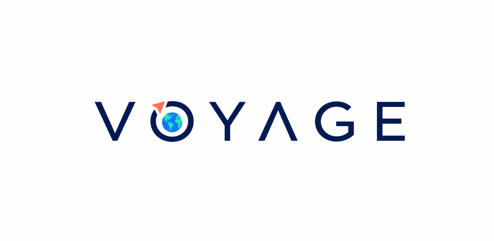

# Voyage brand direction

## Selected logo

The selected Voyage logo is a wordmark built around an orbital **O**:

- The earth represents the shared destination and the wider world of travel.
- The navy ring remains readable as the letter **O**.
- The coral arrow continues the ring from inside the letter, expressing movement around and beyond the world.
- The widely spaced geometric typography keeps the identity modern and minimal.
- The flat blue, teal, coral, and navy palette gives the mark a friendly, lightly cartoonish character without becoming illustrative.

This PNG is the approved concept reference. A production pass should recreate it as precise vector artwork and derive the primary lockup, standalone orbital-O mark, app icon, monochrome variants, and light/dark background treatments from the same geometry.

## Status

**Concept approved July 18, 2026.**

Earlier explorations remain in `design/logo-concepts/` as design history; they are not active brand directions.
